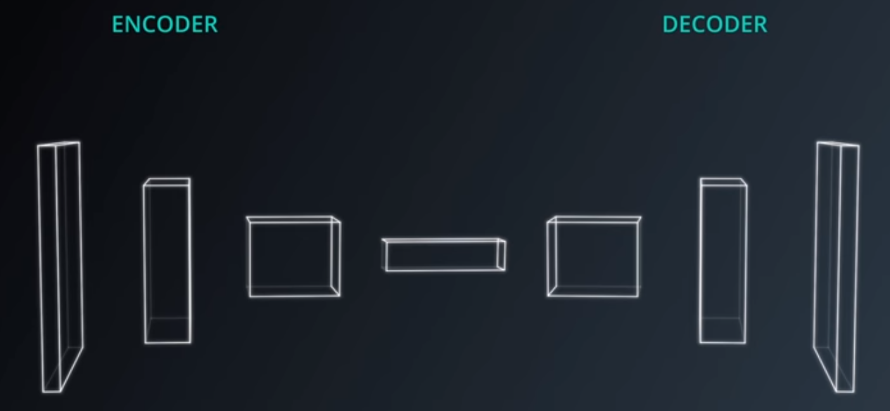
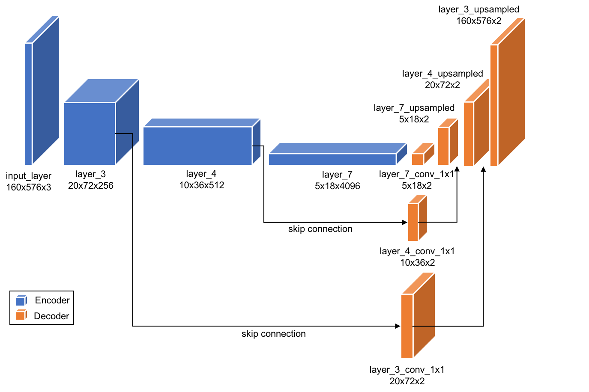
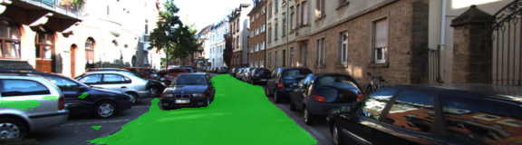
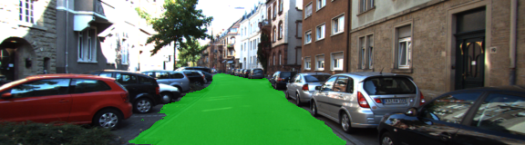
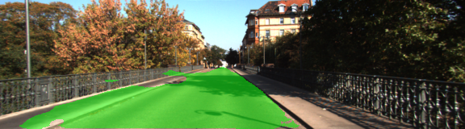
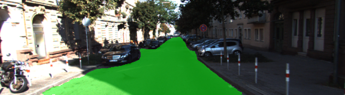
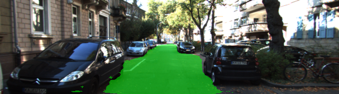

# Semantic Segmentation
## Introduction
The goal of this project is label the pixels in road image, with a Fully Convolutional Network (FCN).

## Basic Concept

#### What is Fully Convolutional Network?
A typical convolution neural network(CNN) consist of a series of convolution layers followed by fully connected layers and ultimately a soft max activation function. However, Fully Convolutional Network convert CNN to 1x1 Convolution and converted Transposed Convolution by upsampling. Structurally an FCN is comprased of two parts which are encoder and decoder. 

#### Fully convolutional Network and Semantic Segmentation
Using Fully Convolutional Network, we learns map the image pixels to pixels, without extracting the region proposals. The FCN network pipeline is an extension of the classical CNN which make the classical CNN take an input arbitrary-sized images. The restriction of CNNs to accept and produce labels only for specific sized  

#### VGG16 as decoder
In this project we will use pre-trained VGG-16 image classification network act as encoder and implemented the decoder portion by upsampling layer 3, 4 and 7 from the VGG-16. Following image shows the schematic FCN architecture.  

## Training

#### Dataset
Download the [Kitti Road dataset](http://www.cvlibs.net/datasets/kitti/eval_road.php) from [here](http://www.cvlibs.net/download.php?file=data_road.zip).  Extract the dataset in the `data` folder.  This will create the folder `data_road` with all the training a test images.
 
#### Obtained VGG16 by help.py
- The model was download using help.py [here](https://s3-us-west-1.amazonaws.com/udacity-selfdrivingcar/vgg.zip).
- The model is not vanilla `VGG16`, but a fully convolutional version, which already contains the 1x1 convolutions to replace the fully connected layers. 

#### Hyper Parameter

|   Parameter   |  Value  |
|:-------------:|:-------:|
|   keep_prob   |   0.5   |
| learning_rate |  0.0009 |
|     epochs    |    50   |
|   batch_size  |    5    |    

#### Result

 
